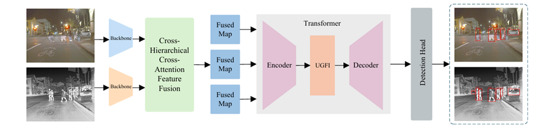

# CHU-DETR

Official implementation of **"Infrared-Visible Dual-Modal Object Detection Transformer with Cross-Hierarchical Attention and U-like Gated Interaction"**.

> **CHU-DETR** (Cross-Hierarchical Attention and U-like Gated Interaction DETR) is an end-to-end dual-modal object detection framework that leverages complementary infrared and visible information for robust detection in complex unstructured environments.

<p align="center">
  
</p>

---

## Highlights

- **CHAF**: Cross-Hierarchical Attention Feature Fusion — top-down context transmission with multi-branch cross-attention for precise multi-scale complementary feature extraction
- **UGFI**: U-like Gated Feature Interaction — pixel-level gating dynamically synergizes deep semantics with shallow details, significantly enhancing spatial localization
- **PSL**: Position-Supervised Loss — resolves bipartite matching ambiguity by supervising classification scores solely with a position metric (IoU)

---

## Results

| Dataset | Classes | mAP50 | mAP75 | mAP | SOTA Comparison |
|:---|:---:|:---:|:---:|:---:|:---|
| **FLIR** | 3 | 87.0 | 48.2 | **50.1** | +2.6% over DMFFNet |
| **LLVIP** | 1 | **98.4** | **81.7** | **69.0** | +2.1% over Fusion-DETR |
| **KAIST** | 1 | **78.4** | 26.2 | **36.3** | +1.9% over MODTN |
| **GIR** | 5 | **92.5** | **69.3** | **60.6** | +4.1% over CMFMNet |

All results obtained with ResNet-50 backbone, trained for 12 epochs on a single NVIDIA RTX 4090.

---

## Installation

### Requirements

- Python ≥ 3.8
- PyTorch ≥ 1.10
- CUDA ≥ 11.3

### Setup

```bash
# Clone the repository
git clone https://github.com/tomsad524/CHU-DETR.git
cd CHU-DETR

# Install dependencies
pip install -r requirements.txt

# Build Deformable Attention CUDA operator
cd models/dino/ops
bash make.sh
cd ../../..
```

---

## Data Preparation

All datasets need to be in COCO format. We provide conversion scripts for KAIST and GIR.

### FLIR (Aligned)

```
FLIR_aligned_coco/
├── annotations/
│   ├── train.json
│   └── val.json
├── train_RGB/
├── train_thermal/
├── val_RGB/
└── val_thermal/
```

### LLVIP

```
LLVIP/
├── coco_annotations/
│   ├── LLVIP_train.json
│   └── LLVIP_test.json
├── visible/train/
├── visible/test/
├── infrared/train/
└── infrared/test/
```

### KAIST

```bash
# Convert from raw KAIST to COCO format
python tools/convert_kaist_to_coco.py \
    --kaist_root /path/to/raw_kaist/ \
    --output_root /path/to/KAIST_COCO/
```

### GIR

```bash
# Convert from raw GIR to COCO format
python tools/convert_gir_to_coco.py \
    --gir_root /path/to/raw_gir/ \
    --output_root /path/to/GIR_COCO/
```

---

## Training

First, download the DINO COCO-pretrained checkpoint from the [DINO repository](https://github.com/IDEA-Research/DINO) and place it at `pretrain/checkpoint0033_coco.pth`. This checkpoint provides backbone initialization for both the visible and infrared streams.

**FLIR:**
```bash
python main.py -c config/DINO/DINO_4scale.py \
    --dataset_file flir_fusion \
    --coco_path /path/to/FLIR_aligned_coco/ \
    --pretrain_model_coco pretrain/checkpoint0033_coco.pth \
    --output_dir ./outputs/flir/
```

**LLVIP:**
```bash
python main.py -c config/DINO/DINO_4scale.py \
    --dataset_file llvip_fusion \
    --coco_path /path/to/LLVIP/ \
    --pretrain_model_coco pretrain/checkpoint0033_coco.pth \
    --output_dir ./outputs/llvip/
```

**KAIST:**
```bash
python main.py -c config/DINO/DINO_4scale.py \
    --dataset_file kaist_fusion \
    --coco_path /path/to/KAIST_COCO/ \
    --pretrain_model_coco pretrain/checkpoint0033_coco.pth \
    --output_dir ./outputs/kaist/
```

**GIR:**
```bash
python main.py -c config/DINO/DINO_4scale.py \
    --dataset_file gir_fusion \
    --coco_path /path/to/GIR_COCO/ \
    --pretrain_model_coco pretrain/checkpoint0033_coco.pth \
    --output_dir ./outputs/gir/
```

---

## Evaluation

```bash
python main.py -c config/DINO/DINO_4scale.py \
    --dataset_file flir_fusion \
    --coco_path /path/to/FLIR_aligned_coco/ \
    --resume ./outputs/flir/checkpoint.pth \
    --eval
```

---

## Ablation Experiments

Reproduce all ablation studies from Section 4.4 of the paper:

```bash
# Run all 22 ablation experiments
python ablations/ablation_runner.py \
    --config_file config/DINO/DINO_4scale.py \
    --coco_path /path/to/FLIR_aligned_coco/ \
    --output_dir ./ablation_results/

# Run a specific table only (5-10)
python ablations/ablation_runner.py \
    --config_file config/DINO/DINO_4scale.py \
    --coco_path /path/to/FLIR_aligned_coco/ \
    --table 5

# Dry-run to preview all configurations
python ablations/ablation_runner.py --dry_run
```

| Table | Content |
|:---|:---|
| Table 5 | Core Component Effectiveness (CHAF, UGFI, PSL) |
| Table 6 | Computational Complexity (Params & FLOPs) |
| Table 7 | Multi-Scale Kernel Configurations in CHAF |
| Table 8 | Context Prior Injection Strategy in CHAF |
| Table 9 | Soft Label Function Design in PSL |
| Table 10 | Internal Interaction Mechanisms in UGFI |

---

## Citation

If you find this work useful, please cite:

```bibtex
@article{hou2025chudetr,
  title   = {Infrared-Visible Dual-Modal Object Detection Transformer with
             Cross-Hierarchical Attention and U-like Gated Interaction},
  author  = {Hou, Zhiqiang and Wu, Xingping and Zhao, Jialu and
             Ma, Sugang and Liu, Yang and Lu, Ruitao and Xi, Jianxiang},
  year    = {2025},
  note    = {Under review}
}
```

---

## License

This project is released under the Apache License 2.0. See [LICENSE](LICENSE) for details.

---

## Acknowledgements

This codebase is built upon [DINO](https://github.com/IDEA-Research/DINO) and [Deformable DETR](https://github.com/fundamentalvision/Deformable-DETR). We thank the authors for their excellent work.